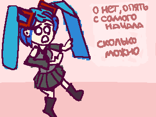

сюда лучше просто не смотреть

&gt; это же уровень восьмого класса в школке 

&gt; зачем переписывать учебник, ты же можешь просто читать и запоминать

&gt; ты не знал этого, да

&gt; просто зачем

<h1>posts</h1>
<ul>
    
        <li>
            <a href="{{ post.url }}">{{ post.title }}</a>
        </li>
    
</ul>
